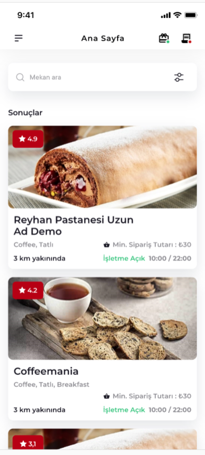

# Restaurant Listing App with Ionic/Angular

## Project Description
]
- The project uses Angular and Ionic. It operates successfully on Android and iOS, supporting both Dark Mode and Light Mode. The design is almost identical to the design above.
- The project accesses location by obtaining location permission, data is fetched in batches of 20 through an API by sending location information, and is continuously displayed using infinite scroll.
- Restaurants fetched from the API by location are listed as card items on the home page.
- The project uses sideMenu to route between pages.
- The project is operating successfully.
### Running the Project

1. Make sure ionic is installed with npm.
2. Then, you can run the project with this command in the project directory:
```bash
flask run
```

### Demo Link
https://ionic-menu-project.web.app/
